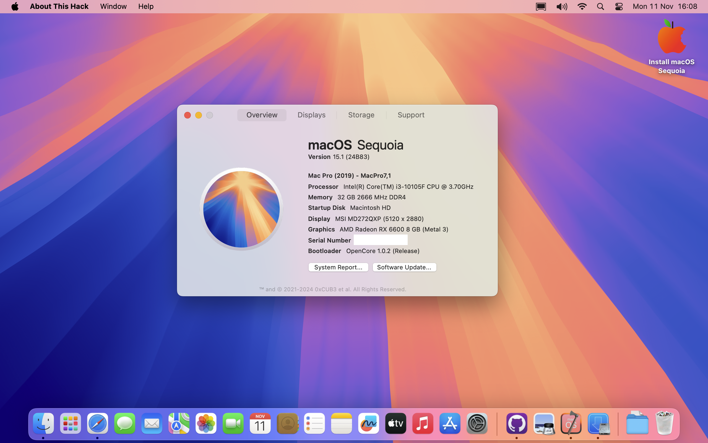

# H510M-E-Hackintosh-Asus-Prime

A repo for installing macOS Ventura to Sequoia on Asus Prime H510M-E using OpenCore.

# PC's Hardware 
- <b>CPU</b>: [Intel i3 10105F](https://www.intel.co.id/content/www/id/id/products/sku/203474/intel-core-i310105f-processor-6m-cache-up-to-4-40-ghz/specifications.html) Quad-Core CPU 3.7Ghz (Comet Lake-U)
- <b>GPU</b>: MSI MECH 2x 8G - AMD Radeon RX 6600 8GB
- <b>Storage</b>: 1TB ADATA S70 Blade NVMe PCIe 4.0 SSD - runs at PCIe 3.0
- <b>RAM</b>: 32Gb runs at 2666MHz DDR4 - 2x 16Gb T-Create Expert 3600MHz DDR4 
- <b>Wi-Fi & Bluetooth</b>: Broadcom BCM94360NG PCIe Card - Connected using adapter into PCIe 1x Slot

# Overview
- <b>OC Version </b>: 1.0.2 Release
- <b>SMBIOS </b>: MacPro7,1 (prefer this SMBIOS because my rig has only dGPU and no iGPU at all)

# Notes
- Fixed AMD Firmware Metal performance drop. Geekbench 6 Metal benchmark improved ~25% performance after this fix. see [before](https://browser.geekbench.com/v6/compute/1804628) and [after](https://browser.geekbench.com/v6/compute/3105699)

# What's Working?
Everything Works, including Handoff / Airplay / Apple Continuity Features / All Apple Features.

# What's Not Working?
- Looks like this is my best hackintosh setup with almost perfect experience like my mac

# Bugs

- AMD (Navi) Cards (Especially this MSI Card) had issue when booting using -v (verbose) boot-args, you will face restart / black screen right after the verbose finished. sometimes it needs 2-3x times to boot into system. **Issue fixed by removing -v from boot-args**

# BIOS Configuration
to be written

# Credits
- [Apple](https://www.apple.com) for macOS.
- [Acidanthera](https://github.com/acidanthera) for most of the kexts.
- [RehabMan](https://github.com/RehabMan) for some ACPI patches.
- [Steve Zheng](https://github.com/stevezhengshiqi) for some patches.
- [zhen-zen](https://github.com/zhen-zen) for YogaSMC.
- [Sniki](https://github.com/Sniki) for some patches.
- [daliansky](https://github.com/daliansky) for some ACPI patches.
- [Moh_Ameen](https://github.com/ameenjuz) for some ACPI patches.
- [blackosx](https://github.com/blackosx/OpenCanopyIcons) for OpenCanopyIcons theme.
- And everyone that helped to develop and improve hackintoshing.
